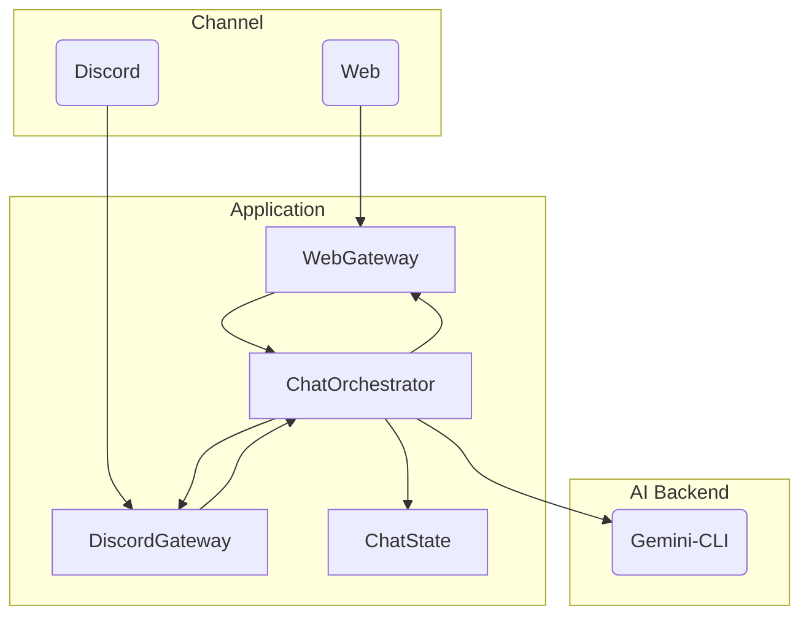
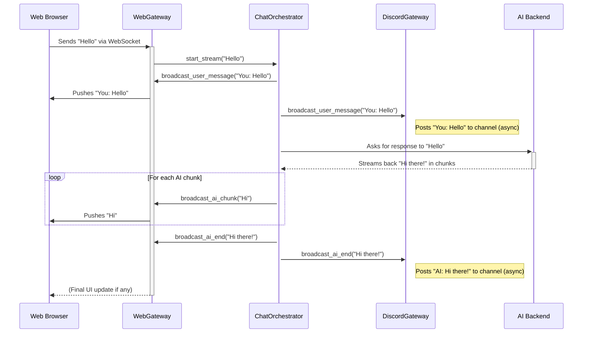

# Doppel

Doppel is a simple application that serves as a versatile chat hub, bridging various frontends (like a web UI and Discord) with a backend AI service. It is designed to be modular and easily extensible for future integrations.

This application is designed to work with [koduki/gemini-cli-proxy](https://github.com/koduki/gemini-cli-proxy) as its backend AI service.

## Features

*   **Web Interface:** A simple, real-time web UI for direct interaction.
*   **Real-time Communication:** Uses WebSockets for low-latency, bidirectional communication with the web UI.
*   **Discord Bot Integration:** A fully integrated Discord bot that interacts with users in designated channels or via Direct Messages.
*   **Dockerized:** Comes with `Dockerfile` and `docker-compose.yaml` for easy setup and deployment.

## Requirements

*   Docker
*   Docker Compose
*   A running instance of [gemini-cli-proxy](https://github.com/koduki/gemini-cli-proxy)

## Setup

1.  **Set up the backend service:**
    This application requires the [gemini-cli-proxy](https://github.com/koduki/gemini-cli-proxy) to be running as the backend. Please follow the setup instructions in its repository first.

2.  **Clone this repository:**
    ```bash
    git clone <repository-url>
    cd doppel
    ```

3.  **Create the environment file:**
    Create a file named `.env` in the project root and add the following variables.

    ```env
    # The base URL for the backend AI service (gemini-cli-proxy)
    APP_BACKEND_ORIGIN=http://your-backend-service-url:3000/

    # Your Discord Bot Token
    DISCORD_TOKEN=your-discord-bot-token-here

    # (Optional) The ID of a specific Discord channel for the bot to post to/listen in.
    # If not set, the bot will only respond to DMs.
    DISCORD_CHANNEL_ID=your-discord-channel-id-here

    # (Optional) Set the log level. Defaults to INFO. Use DEBUG for detailed troubleshooting.
    LOG_LEVEL=DEBUG
    ```

## Usage

To start the application with live-reloading, run the following command:

```bash
docker compose watch
docker compose logs -f 
```

The web interface will be available at `http://localhost:8080`.

## Architecture

The application is built on a modular, decoupled architecture to facilitate scalability and maintainability. The core principle is the separation of concerns, where each component has a single, well-defined responsibility.

### Component Diagram

This diagram illustrates the relationships and dependencies between the major components of the application.



### Component Descriptions

*   **`app.rb` (Orchestrator Loader):** The main entry point. It initializes all components, injects dependencies (e.g., passing the `ChatState` to the gateways), and starts the Sinatra web server. It knows *what* components exist but not *how* they work.

*   **`ChatOrchestrator`:** The brain of the application. It receives requests from all gateways, communicates with the backend AI service, and then passes the response back to all registered "responders" (the gateways). It is completely unaware of the specifics of Web or Discord.

*   **Gateways (`WebGateway`, `DiscordGateway`):** Responsible for communicating with external platforms. They adapt platform-specific messages into a common format for the `ChatOrchestrator` and vice-versa.

*   **`ChatState`:** A thread-safe class responsible for managing the shared chat history.

### Sequence Diagram: Web User Message Flow

This diagram shows the sequence of events when a user sends a message from the web interface.



This decoupled design allows new gateways (e.g., for Slack) to be added with minimal changes to the core application logic.

## License

This project is licensed under the Apache License 2.0 - see the [LICENSE](LICENSE) file for details.